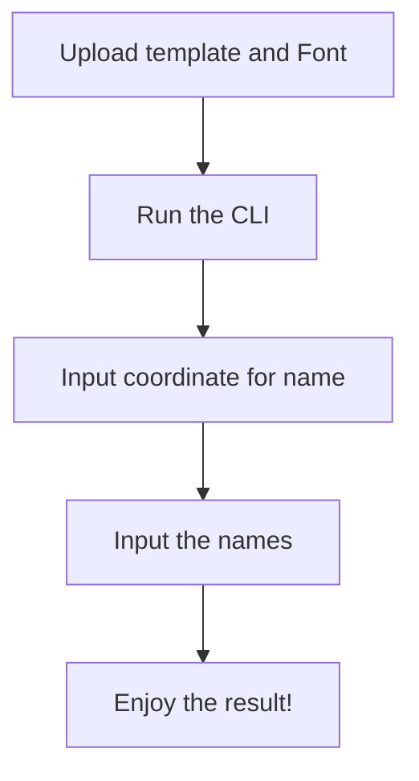

# Python Certificate Generator
###### https://github.com/jaleisme/uts-psm-image-processing

###### This project is about Certificate Generator, where you can easily bulk-generate certificates using python. Here are packages that were used in making this project:
###### 1. Matplotlib -> Making a plot for mapping the coordinate for the image.
###### 2. Numpy (optional) -> Manually compressing image using some complex algorithm (K-Means clustering, Singular Vector Decomposition).
###### 3. Pillow -> Processing, manipulating, and compressing image.
###### 4. OS - Directory and file management for Python.
###### Algorithm:
###### Choose the template and put it inside the root directory of the project, and simply run the project. If it was the first time you're using this project, kindly run this code on your terminal: pip install matplotlib pillow numpy
###### Link Youtube: https://youtu.be/5fufXrH_hPg

###### I haven't implement any machine learning in this project majorly. For some experimental purposes, i've tried using K-Means Clustering but it turns out really bad because the text and the template can't be read thoroughly by the model because the model only consume some color samples. This was resulting in a blank generated image. For now, i use the built-in compression function from pillow.  